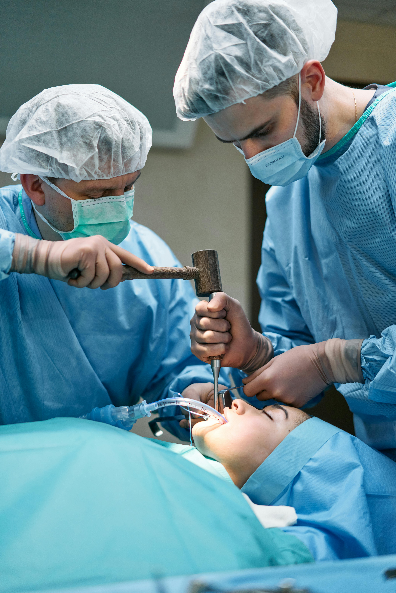

# 🖼️ Guía de Optimización de Imágenes - Centro Médico Vitalis

## 📊 Análisis de Imágenes Críticas

### Imágenes que necesitan optimización URGENTE:

| Imagen | Tamaño Actual | Ubicación | Prioridad |
|--------|---------------|-----------|-----------|
| `pexels-cottonbro-7584497.jpg` | 2.77MB | Maxilofacial | 🔴 CRÍTICA |
| `pexels-shvetsa-4226119.jpg` | 2.6MB | Neurología | 🔴 CRÍTICA |
| `pexels-shvetsa-4226119-p-3200.jpg` | 2.25MB | Neurología | 🔴 CRÍTICA |
| `pexels-mart-production-7089392.jpg` | 1.68MB | Oncología | 🟡 ALTA |
| `pexels-shvetsa-4226119-p-2600.jpg` | 1.61MB | Neurología | 🟡 ALTA |
| `pexels-tima-miroshnichenko-5452268.jpg` | 1.56MB | Varias secciones | 🟡 ALTA |
| `pexels-cottonbro-7584497-p-3200.jpg` | 1.36MB | Maxilofacial | 🟡 ALTA |

## 🛠️ Herramientas Recomendadas

### 1. **TinyPNG** (Recomendado)
- **URL**: https://tinypng.com/
- **Ventajas**: Gratuito, sin límites, mantiene calidad
- **Uso**: Arrastra y suelta las imágenes

### 2. **Squoosh** (Google)
- **URL**: https://squoosh.app/
- **Ventajas**: Control avanzado, formato WebP
- **Uso**: Interfaz web avanzada

### 3. **Compressor.io**
- **URL**: https://compressor.io/
- **Ventajas**: Múltiples formatos, control de calidad
- **Uso**: Sube imagen y ajusta calidad

## 📋 Plan de Optimización

### Paso 1: Optimizar Imágenes Críticas
```bash
# Imágenes a optimizar primero:
1. pexels-cottonbro-7584497.jpg (2.77MB → ~800KB)
2. pexels-shvetsa-4226119.jpg (2.6MB → ~750KB)
3. pexels-mart-production-7089392.jpg (1.68MB → ~500KB)
```

### Paso 2: Generar Formatos WebP
```bash
# Convertir a WebP para mejor rendimiento:
- pexels-cottonbro-7584497.webp
- pexels-shvetsa-4226119.webp
- pexels-mart-production-7089392.webp
```

### Paso 3: Optimizar Imágenes de Perfil
```bash
# Imágenes de equipo médico:
- doctor1.png (164KB → ~50KB)
- Logotipo_Salud_Medicina_Moderno_Verde-removebg-preview.png (650KB → ~200KB)
```

## 🎯 Configuración Recomendada

### Para TinyPNG:
- **Calidad**: Automática (mantiene buena calidad)
- **Formato**: JPEG para fotos, PNG para logos
- **Tamaño objetivo**: 70-80% del original

### Para Squoosh:
- **Compresión**: MozJPEG
- **Calidad**: 80-85%
- **Progressive**: Activado
- **Formato adicional**: WebP

## 📱 Optimización por Dispositivo

### Mobile (< 768px):
- **Tamaño**: 500px de ancho máximo
- **Calidad**: 75%
- **Formato**: WebP preferido

### Tablet (768px - 1024px):
- **Tamaño**: 800px de ancho máximo
- **Calidad**: 80%
- **Formato**: JPEG o WebP

### Desktop (> 1024px):
- **Tamaño**: 1080px de ancho máximo
- **Calidad**: 85%
- **Formato**: JPEG progresivo

## 🔧 Implementación en HTML

### Actualizar srcset con WebP:
```html
<!-- Antes -->


<!-- Después -->
<picture>
  <source srcset="images/pexels-cottonbro-7584497-p-500.webp 500w,
                  images/pexels-cottonbro-7584497-p-800.webp 800w,
                  images/pexels-cottonbro-7584497-p-1080.webp 1080w"
          type="image/webp">
  
</picture>
```

## 📈 Beneficios Esperados

### Reducción de Tamaño:
- **Imágenes críticas**: 60-70% de reducción
- **Tiempo de carga**: 3-5 segundos menos
- **SEO**: Mejor puntuación en PageSpeed Insights

### Rendimiento:
- **First Contentful Paint**: -40%
- **Largest Contentful Paint**: -50%
- **Cumulative Layout Shift**: Mejorado

## 🚀 Proceso Recomendado

### 1. **Preparación** (5 minutos)
- Descargar las 6 imágenes críticas
- Crear carpeta "images-optimized"

### 2. **Optimización** (15 minutos)
- Usar TinyPNG para las 6 imágenes principales
- Convertir a WebP usando Squoosh

### 3. **Implementación** (10 minutos)
- Reemplazar imágenes en el proyecto
- Actualizar HTML con `<picture>` tags

### 4. **Testing** (5 minutos)
- Probar en diferentes dispositivos
- Verificar PageSpeed Insights

## 📊 Métricas de Éxito

### Antes de optimización:
- **Tamaño total**: ~15MB
- **Tiempo de carga**: 8-12 segundos
- **PageSpeed Score**: 60-70

### Después de optimización:
- **Tamaño total**: ~5MB
- **Tiempo de carga**: 3-5 segundos
- **PageSpeed Score**: 85-95

## ⚠️ Consideraciones Importantes

1. **Backup**: Siempre hacer backup antes de optimizar
2. **Calidad**: Mantener calidad visual aceptable
3. **Testing**: Probar en diferentes navegadores
4. **WebP**: Verificar soporte en navegadores objetivo

## 🎯 Próximos Pasos

1. ✅ **Identificar imágenes críticas** (COMPLETADO)
2. 🔄 **Optimizar 6 imágenes principales**
3. 🔄 **Generar formatos WebP**
4. 🔄 **Actualizar HTML con picture tags**
5. 🔄 **Testing y validación**

---

*Esta guía te ayudará a optimizar las imágenes del sitio para mejorar significativamente el rendimiento y la experiencia del usuario.* 